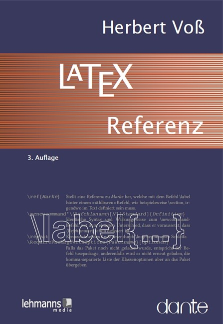
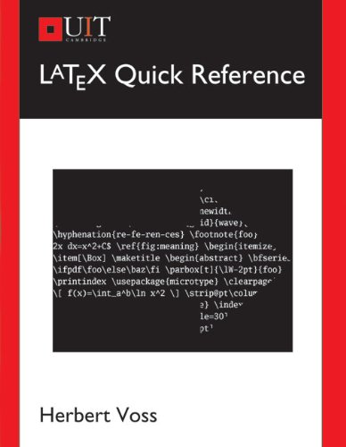

$\LaTeX$ quick reference
===

<a href="">
  
</a>

¿Qué comando, qué valor, qué parámetro?

Esta referencia pretende simplificar la búsqueda al describir brevemente la sintaxis general de los entornos y macros de LaTeX, así como el significado de los diversos registros de longitud y conteo.

LaTeX facilita la creación de documentos desde el tamaño de una página hasta varios miles de páginas. Sin embargo, la potencia de todo el sistema TeX requiere que los usuarios novatos y expertos tengan un libro de Instrucciones de LaTeX en el estante cuando quieran crear sus documentos en el menor tiempo posible.

La tercera edición fue revisada y complementada por una sección sobre LaTeX3.

----

Herbert Voß trata con TeX / LaTeX y PostScript, ya que no podría continuar con los sistemas convencionales. Numerosas publicaciones sobre el tema de la informática. Nacido en 1949 cerca de Hanover, 1966 madurez media, examen de oficial de 1969 a electricista de corriente eléctrica. 1973 Ing. Grad. En Berlín, 1975 Dipl.-Ing., 1978 Dr.-Ing., 1982 Studienassesor, 1986 Director de estudio, 2002 Profesor.

<a href="">
  
</a>

## Tabla de contenidos

1. Los programos
2. El documento
3. Sutilezas tipográficas
4. Lista de comandos
5. Matemáticas
6. Tipo de letra
7. Paquetes
8. Bibliografías
* Apéndice
* Bibliografía
* Índice de comandos y conceptos
* Gente

Descarga los ejemplos:

```bash
ftp://ftp.ctan.org/tex-archive/info/examples/LaTeX-Referenz/
```

```tex
$\pi/2=\directlua{tex.print(math.pi/2)}$
```