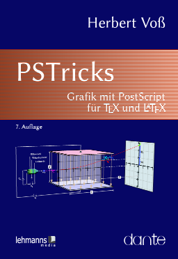
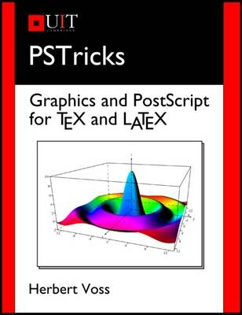

PSTricks
===
## Grafik mit PostScript für $\TeX$ und $\LaTeX$

<a href="">
  
</a>

Antes de empezar vamos a descargar los ejemplos de los libros:

```bash
# Descargando los archivos del libro PSTricks de la 7ma edición alemana.
carlosal1015@Oromion:~/GitHub/Curso-de-LaTeX/LaTeX & sus amigos/PSTricks/examples$ wget ftp://ftp.ctan.org/tex-archive/info/examples/PSTricks_7_de.zip
carlosal1015@Oromion:~/GitHub/Curso-de-LaTeX/LaTeX & sus amigos/PSTricks/examples$ unzip PSTricks_7_de.zip
carlosal1015@Oromion:~/GitHub/Curso-de-LaTeX/LaTeX & sus amigos/PSTricks/examples$ rm PSTricks_7_de.zip
carlosal1015@Oromion:~/GitHub/Curso-de-LaTeX/LaTeX & sus amigos/PSTricks/examples$ cd PSTricks_7_de/
```

## Graphics and PostScript for $\TeX$ and $\LaTeX$

<a href="https://www.youtube.com/watch?v=SBUOhyXcR1Q">
  
</a>

Los gráficos y las tablas en varias formas son de hecho el contenido de cada ensayo más o menos largo. Existen diferencias considerables en la forma externa, especialmente en los gráficos. Los gráficos escaneados, por ejemplo, aún no se han distinguido de los creados por ellos mismos. Este libro presenta el principio del diseño gráfico bajo el sistema profesional de texto a frase de TeX. Hace uso del poderoso lenguaje de programación PostScript para crear gráficos de alta calidad de cualquier tipo, que se pueden integrar fácilmente en el documento TeX. Esta edición está completamente a todo color.

El desarrollo de TEX no enfatizó necesariamente las capacidades gráficas del sistema. Por lo tanto, TEX solo tiene elementos gráficos rudimentarios que se han ampliado con la introducción de LaTeX pero que aún son insatisfactorios. Los paquetes, los cuales están agrupados bajo el sinónimo PSTricks crean esta situación haciendo etc. proporcionar líneas simples en los gráficos, imágenes tridimensionales, los árboles, los nudos, las cartas al usuario todo lo disponible, lo que hace un gráficos de alta calidad. Esto se muestra con innumerables ejemplos, que siempre se completan con el código subyacente. Trabajar en el nivel de PostScript no implica ninguna restricción en la salida en formato PDF. Se muestran varios métodos para generar un solo gráfico o el documento completo en formato PDF.


Herbert Voß ha estado trabajando en TeX / LaTeX y PostScript ya que los sistemas tradicionales no fueron más allá. Numerosas publicaciones sobre el tema de la informática. Herbert Voß ha estado trabajando en TeX / LaTeX y PostScript ya que los sistemas tradicionales no fueron más allá. Numerosas publicaciones sobre el tema de la informática.

```bash
# Descargando los archivos del libro PSTricks de la 6ta edición inglesa.
carlosal1015@Oromion:~/GitHub/Curso-de-LaTeX/LaTeX & sus amigos/PSTricks/examples$ wget ftp://ftp.ctan.org/tex-archive/info/examples/PSTricks_en.zip
carlosal1015@Oromion:~/GitHub/Curso-de-LaTeX/LaTeX & sus amigos/PSTricks/examples$ unzip PSTricks_en.zip
carlosal1015@Oromion:~/GitHub/Curso-de-LaTeX/LaTeX & sus amigos/PSTricks/examples$ rm PSTricks_en.zip
carlosal1015@Oromion:~/GitHub/Curso-de-LaTeX/LaTeX & sus amigos/PSTricks/examples$ cd PSTricks_en/
```

El libro describe todo, desde cómo dibujar líneas simples en curvas, hasta crear imágenes tridimensionales, árboles, nudos, cuadros, etc. El libro contiene cientos de ejemplos, con código listo para ejecutar, para impresión en papel o PDF.

Cuando TeX se desarrolló originalmente, las capacidades gráficas no eran una preocupación importante. Como resultado, TeX proporciona solo soporte básico de gráficos, y aunque la introducción de LaTeX mejoró las cosas, se necesitaba algo más. PSTricks aborda esto al proporcionar una amplia gama de instalaciones gráficas, desde líneas simples y curvas, hasta imágenes en 3D, árboles, nudos y tablas, etc., con soporte para transformaciones, superposiciones y más, para formar un entorno de gráficos completo.

Este libro es una guía de referencia comprehensiva para PSTricks. Contiene cientos de ejemplos (64 páginas en color), con el código fuente disponible en línea.

Público objetivo:
- Matemáticos, ingenieros, científicos, estadísticos y economistas
- Graphic artistas
- Colegio y estudiantes
- Libros y editores de revistas