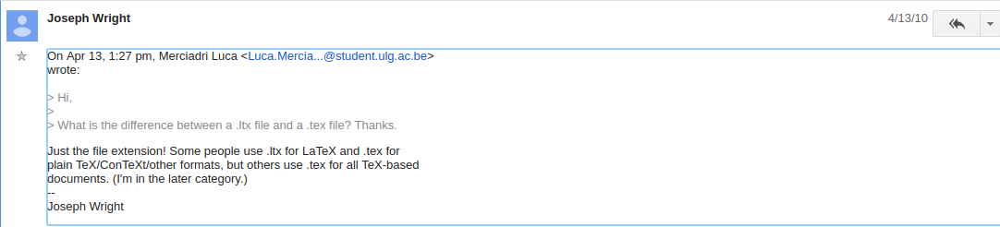

Tabla de contenidos
===

1. Introducción
2. Primeros pasos
3. El sistema coordenado
4. Líneas y polígonos
5. Círculos, elipses y curvas
6. Puntos
7. Relleno
8. Flechas
9. Etiquetas
10. Cajas
11. Estilos personalizados y objetos
12. Coordenadas
13. Superposiciones
14. Básicos
15. [`pst-plot`](https://ctan.org/pkg/pst-plot?lang=en): Trazado de funciones y datos
16. [`pst-node`](https://ctan.org/pkg/pst-node?lang=en): Nodos y conexiones

> Nota:
> 
> Los archivos de extensión `.ltx` o `.tex` son extensiones estándar tanto para $\LaTeX$ como para $\TeX$ plano. Joseph Right lo asevera:

<a href="https://groups.google.com/forum/#!topic/comp.text.tex/hMe5ROHkdeE">
  
> </a>

Para compilar primero debemos escribir las siguientes órdenes, por ejemplo:

```bash
carlosal1015@Oromion:~/GitHub/Curso-de-LaTeX/LaTeX & sus amigos/PSTricks/examples/PSTricks_en$ latex 00-00-1.ltx
carlosal1015@Oromion:~/GitHub/Curso-de-LaTeX/LaTeX & sus amigos/PSTricks/examples/PSTricks_en$ dvips 00-00-1.dvi
carlosal1015@Oromion:~/GitHub/Curso-de-LaTeX/LaTeX & sus amigos/PSTricks/examples/PSTricks_en$ ps2pdf 00-00-1.ps
```

Y así se genera un archivo llamado [`00-00-1.pdf`]().